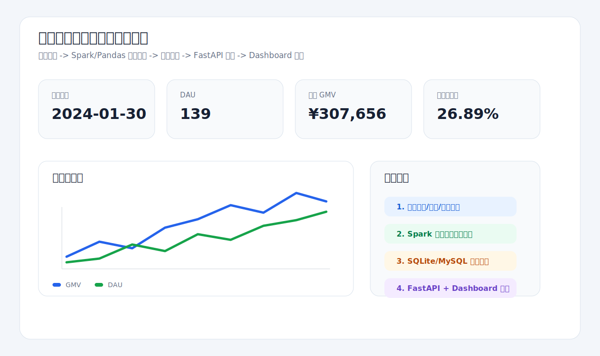

# 分布式大数据处理与分析平台

一个面向简历和面试演示的端到端大数据项目，模拟电商业务数据从采集、离线计算、指标存储、API 查询到可视化展示和容器化部署的完整链路。



## 核心能力

- 数据生成：模拟用户、商品和行为事件数据，形成可复现的业务日志。
- 离线计算：基于 Spark/PySpark 计算 DAU、转化率、销售额、品类 GMV、Top 商品和留存等指标。
- 本地兜底：提供 Pandas 版本 ETL，方便在未安装 Spark 的机器上快速演示完整链路。
- 指标存储：将聚合结果写入 CSV 和 SQLite，结构可迁移到 MySQL 指标表。
- 指标服务：基于 FastAPI 提供 `/metrics/daily`、`/metrics/categories`、`/metrics/top-items`、`/metrics/retention` 等接口。
- 可视化报表：生成 HTML Dashboard 展示核心业务指标。
- 容器化部署：提供 Dockerfile、docker-compose 和 Kubernetes YAML，模拟 API、数据库和 Spark Job 的统一部署。

## 技术栈

Spark / PySpark / Pandas / FastAPI / MySQL / SQLite / Docker / Kubernetes

## 目录结构

```text
.
├── src/bigdata_platform/
│   ├── generate_events.py     # 模拟数据生成
│   ├── local_etl.py           # Pandas 本地 ETL
│   ├── spark_etl.py           # Spark 离线计算
│   ├── api.py                 # FastAPI 指标服务
│   └── report.py              # HTML 报表生成
├── scripts/                   # Windows 演示脚本
├── sql/schema.sql             # MySQL 指标表结构
├── k8s/                       # Kubernetes 部署文件
├── Dockerfile.api
├── docker-compose.yml
└── requirements.txt
```

## 快速运行

安装依赖：

```bash
pip install -r requirements.txt
```

本地小规模演示：

```powershell
.\scripts\run_small_demo.ps1
```

完整本地演示：

```powershell
.\scripts\run_local_demo.ps1
```

启动 API：

```powershell
.\scripts\start_api.ps1
```

Spark 本地计算：

```powershell
.\scripts\run_spark_local.ps1
```

## 公开仓库说明

公开仓库不包含 `.venv`、原始模拟数据、SQLite 数据库、生成报表、浏览器 profile 和 Hadoop/Winutils 本地文件。运行脚本后会自动在本地生成 `data/raw/` 和 `warehouse/` 目录。
